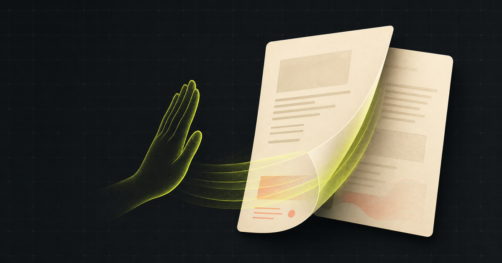
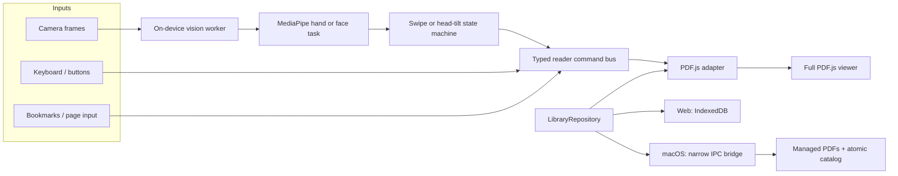

# Gesture Reader



Gesture Reader is a local-first PDF library and reader for the web and macOS.
It turns one page at a time when the computer's camera recognizes either an
open-palm swipe or a deliberate head tilt—all vision processing happens on the
device. Tilt your head right to advance or left to go back; palm swipes keep
the familiar left-to-advance, right-to-go-back motion.

The application combines the complete PDF.js reading experience with an
intentional, conservative gesture state machine. PDFs, thumbnails, reading
progress, bookmarks, camera frames, and hand landmarks are never sent to an
application server.

## Why this exists

PDF readers assume that reaching for a mouse, trackpad, or keyboard is always
convenient. It is not when both hands are occupied: playing from sheet music,
presenting, following a workshop manual, cooking from a recipe, or simply
reading from a little farther away.

Gesture Reader was created to make that one frequent action—turning a
page—possible without touching the computer, while keeping the document reader
fully useful when the camera is disabled. Gesture input is an optional control
surface, not a replacement for keyboard, mouse, touchpad, or on-screen
navigation.

The project follows three principles:

1. **Local by default.** Documents and camera data stay on the device.
2. **One gesture, one result.** A recognized swipe or tilt turns exactly one
   page and never wraps at document boundaries.
3. **A real PDF reader first.** Gesture support sits beside search, selection,
   thumbnails, outlines, print, download, zoom, rotation, and multiple layouts.

## What it can do

### PDF reader

- Full PDF.js viewer with thumbnails, outline/table of contents, text search
  and highlighting, selection, page jump, zoom and fit presets, rotation,
  single/continuous/two-page layouts, presentation mode, print, download, and
  password prompts.
- Page bookmarks and restoration of the last page, zoom, layout, and rotation.
- Keyboard, mouse, touchpad, and labeled on-screen controls remain available
  whether gestures are enabled or not.

### Local library

- Import multiple PDFs with the file picker or drag and drop.
- Extract document metadata and a first-page cover thumbnail.
- Search by title or author and sort by recent activity, title, or progress.
- Detect duplicate imports using a SHA-256 fingerprint.
- Remove only the app-managed copy; the original source PDF is never deleted.
- Show storage usage, persistence status, and browser quota warnings.

### Gesture controls

- Opt-in video permission with internal or external camera selection.
- Choice of responsive palm-swipe or hands-free head-tilt control.
- Source-aware page directions: right head tilt advances and left head tilt
  goes back, while palm swipes retain their natural opposite mapping.
- Mirrored preview, sensitivity settings, direction inversion, and a
  two-direction calibration check.
- Visible confidence, palm-lock, cooldown, and reset feedback.
- Recognition pauses during dialogs, text entry, page animation, window blur,
  or backgrounding.
- Camera tracks are stopped immediately when gestures are disabled or the app
  is hidden or closed.

## Architecture

The web PWA and macOS application share the same React/TypeScript reader,
gesture UI, domain types, and command flow. Platform-specific behavior is kept
behind small interfaces.



### Shared reader core

`LibraryRepository` hides where PDF bytes and reading state live. The browser
implementation uses IndexedDB and object URLs; the desktop implementation uses
a narrow preload bridge to Electron-managed storage. The UI selects the
repository at runtime without branching throughout the reader.

All navigation enters a `ReaderCommand` bus. Buttons, keyboard shortcuts,
bookmarks, page input, and recognized gestures issue the same typed commands.
Gesture code never reaches into PDF.js directly, which keeps page-boundary
behavior testable and prevents camera logic from becoming coupled to the
viewer. The gesture source stays attached until command routing, allowing head
tilts and palm swipes to use different, explicit direction mappings.

### PDF integration

The project embeds the full PDF.js viewer through the pinned
`pdfjs-viewer-element` wrapper rather than building a partial canvas renderer.
A small adapter listens to PDF.js event-bus events for document lifecycle,
page, scale, rotation, scroll mode, and spread mode changes. This preserves
PDF.js features while isolating its internal APIs from the rest of the
application.

### Gesture pipeline

When gestures are enabled, the app captures video-only frames at approximately
640×480 and submits them to a dedicated worker. Only one frame may be in
flight, so a busy recognizer drops incoming frames instead of creating latency.
MediaPipe's Gesture Recognizer, Face Landmarker, WASM, and both model assets are
bundled locally. Palm and head control are exclusive modes, so the application
never runs both models over the same frame. Switching modes replaces only the
vision worker; the camera stream stays connected.

The deterministic swipe detector then:

1. Arms after three of four stationary `Open_Palm` frames. A velocity gate keeps
   an entering hand from counting as a swipe; the confidence threshold ranges
   from `0.55` in Quick mode to `0.70` in Steady mode.
2. Tracks palm-center motion for 65–700 ms, depending on sensitivity.
3. Requires horizontal displacement of 10–18% of frame width plus consistent
   movement in the detected direction. Balanced mode has a velocity-qualified
   10% fast path, allowing a deliberate swipe to turn on its second motion
   frame without weakening the slow-movement and spike rejection gates.
4. Compares horizontal travel with the full vertical path, rejecting spikes,
   deep arcs, and ordinary hand repositioning.
5. Uses finger-extension geometry after lock, tolerating classifier blur while
   canceling a closed fist. A dropped landmark frame re-anchors the trajectory
   and requires fresh continuous movement.
6. Emits exactly one direction, then latches until a hand-out or neutral
   recenter and a 700–900 ms cooldown.

Head mode derives mirrored-preview roll from the eye line reported by Face
Landmarker. It learns the reader's comfortable centered position, then requires
a 10–15° tilt held for 220–420 ms depending on sensitivity. A tilt emits one
page turn, latches through cooldown, and cannot fire again until the reader
returns to the learned neutral band. Short spikes, oscillation, face loss, and
remaining tilted are rejected; **Recenter head position** explicitly relearns
the baseline. A right tilt issues the next-page command; a left tilt issues the
previous-page command. This mapping is separate from palm swipes, where left
means next and right means previous.

This hybrid approach uses ML for hand, open-palm, and face-landmark recognition,
but transparent state machines for page-turn decisions. The thresholds are
easy to reason about, calibrate, and replay at different camera frame rates.
The camera loop preserves source aspect ratio, never queues duplicate frames,
and discards late gesture results whenever the reader is paused.

## Architectural decisions

| Decision | Why | Tradeoff |
| --- | --- | --- |
| Use the full PDF.js viewer | Search, selection, outlines, print, passwords, accessibility, and layout controls are difficult to reproduce correctly. | The viewer is heavier and its event bus needs an adapter. |
| Share React/TypeScript across web and desktop | Reader behavior, gesture UX, and tests remain consistent across both surfaces. | Platform differences must stay behind explicit interfaces. |
| Package macOS with Electron | Chromium provides predictable behavior for PDF.js, camera APIs, workers, WebAssembly, and the existing React renderer. | The application bundle is larger than a native or Tauri build. |
| Keep recognition in a worker | Camera inference cannot block PDF scrolling or UI interaction. | Frames and worker lifecycle require careful coordination. |
| Use deterministic motion state machines | Palm lock, displacement, head hold, neutral reset, cooldown, and false-positive behavior can be tested without retraining a model. | Thresholds still need physical calibration for different cameras, posture, and lighting. |
| Keep web and macOS libraries separate | No account, backend, or synchronization service is required; privacy boundaries stay obvious. | Reading state does not move automatically between installations. |
| Copy desktop imports into managed storage | The application can offer a stable library and safe removal without mutating the original file. | Imported PDFs consume additional local disk space. |
| Self-host runtime assets | The reader launches offline and camera/PDF processing has no runtime CDN dependency. | Builds are larger, and the pinned models must be updated intentionally. |

## Storage and privacy model

### Web

- PDF blobs, metadata, thumbnails, bookmarks, and reading state are stored in
  IndexedDB.
- The app requests persistent browser storage after a successful import.
- Opening a PDF creates a temporary object URL that is revoked after use.
- Browser storage remains subject to the browser's quota and eviction policy.

### macOS

- Imported PDFs are copied under Electron's application-data directory.
- Metadata lives in a versioned JSON catalog written through a temporary file
  and atomic rename.
- A corrupt catalog is preserved for recovery rather than silently overwritten.
- PDFs are served to PDF.js through an allowlisted `gesture-reader://` protocol
  with byte-range support.

There is no account system, cloud sync, telemetry, analytics pipeline, or
remote-PDF URL loader. The Content Security Policy restricts runtime resources
to the application, local blobs, workers, and the desktop protocol.

## Electron security model

The desktop renderer is packaged locally; it never loads the hosted web app.

- Renderer sandbox enabled.
- Context isolation enabled.
- Node integration disabled.
- Narrow, explicit preload API for library operations.
- IPC requests accepted only from the trusted application origin.
- Navigation and new windows blocked outside the application.
- Camera permission restricted to video from the application origin.
- Managed PDF identifiers validated before filesystem access.
- Application protocol paths confined to the packaged renderer and managed
  library.

## Getting started

Requirements:

- Node.js 22.13 or newer
- npm
- A browser with WebAssembly, workers, IndexedDB, and camera APIs

```bash
git clone https://github.com/manynames3/gesture-reader.git
cd gesture-reader
npm install
npm run dev
```

Open the local URL printed by the development server. Camera access works on
`localhost`; a non-local web deployment must use HTTPS.

The first development or production build copies the pinned PDF.js and
MediaPipe runtime files into `public/vendor/`. If the gesture model is not
already present, the build downloads it and verifies its SHA-256 digest before
using it.

## Build targets

### Web/PWA

```bash
npm run build
npm run start
```

The web surface is an installable PWA. Its library belongs to that browser
profile and is not synchronized with the desktop application.

### macOS

```bash
npm run electron:package
```

Electron Forge writes the `.app`, `.dmg`, and `.zip` under `out/`. The current
personal-use release is ad-hoc signed but not notarized or distributed through
the Mac App Store.

## Using gestures

### Palm swipe

1. Open a PDF and select **Enable gestures**.
2. Choose the camera and position your full wrist and all five fingers inside
   the preview.
3. Hold the open palm still until the lock reaches **3/3**.
4. Swipe left to go to the next page or right to go to the previous page.
5. Move the hand out of view briefly after a turn so the detector can reset.

### Head tilt

1. Select **Head tilt** under **Control method**.
2. Look comfortably toward the screen while the camera learns your center.
3. Tilt **right for the next page** or **left for the previous page** by roughly
   12–15°, then hold until the progress reaches 100%.
4. Return fully to center before the next page turn.
5. Select **Recenter head position** after moving the camera or changing your
   reading posture.

If movement feels backward, enable **Reverse page-turn direction**. The
two-step calibration check confirms both directions without turning document
pages.

## Keyboard and conventional controls

- `Left Arrow`: previous page
- `Right Arrow`: next page
- Page input: jump to a page
- Bookmark control: save or remove the current page
- PDF.js toolbar: search, zoom, fit, rotate, layout, print, save, and
  presentation controls

## Testing

```bash
npm test
npm run lint
npx tsc --noEmit
```

The test suite covers:

- Palm arming, jitter, vertical movement, confidence loss, motion blur,
  responsive fast-path recognition, cooldown, neutral reset, boundaries, and
  repeated-frame suppression.
- Head-roll geometry, neutral calibration, deliberate holds at 8/12/18 FPS,
  face loss, posture drift, spike rejection, cooldown, return-to-center, noisy
  right-to-left sequences, and source-aware page-direction routing.
- Web import, SHA-256 deduplication, IndexedDB state, removal, and quota errors.
- Desktop catalog recovery, managed storage, and reading-state persistence.
- PDF navigation and legacy zoom-state repair.
- Browser flows with real PDF bytes, a fake local camera stream, mode switching
  without a second camera request, and the real bundled Face Landmarker model.
- Electron startup, isolated IPC, secure protocol, and managed PDF storage.
- Rendered application metadata and self-hosted runtime assets.

Automated browser tests currently run against Chromium. Physical camera testing
is still important because framing, lighting, motion blur, and external-camera
drivers vary.

## Project structure

```text
app/                         App shell, metadata, CSP, and responsive styles
components/gesture-reader/   Library, PDF reader, and gesture setup UI
lib/gesture/                 Worker bridge, MediaPipe worker, palm/head detectors
lib/pdf/                     PDF metadata analysis and zoom normalization
lib/reader/                  Typed command bus and page-boundary logic
lib/storage/                 Web and desktop repository adapters
electron/                    Hardened main process, preload, and local catalog
scripts/                     Runtime-asset and Electron-renderer builds
tests/                       Unit, browser, rendered-output, and Electron tests
```

## Current scope

Gesture Reader intentionally does not include PDF editing, annotations,
signatures, OCR, accounts, cloud synchronization, remote PDF URLs, or
telemetry. The first packaged desktop target is macOS; the shared reader core
keeps future Windows packaging possible.
