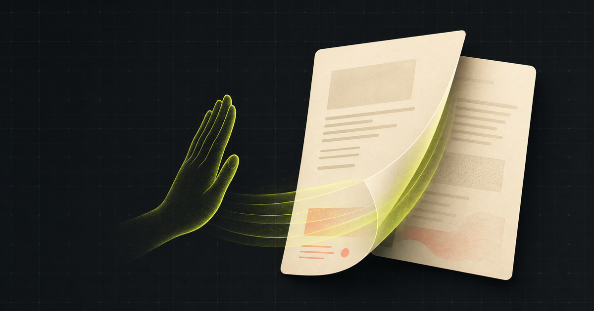
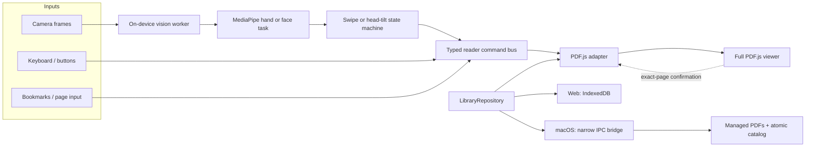

# Gesture Reader

[Open the web reader](https://gesture-reader.pages.dev) · [Source code](https://github.com/manynames3/gesture-reader) · [Quality audit and remaining checks](docs/product-quality-audit.md)



Gesture Reader is a local-first PDF library and reader for the web and macOS.
It turns one page at a time when the computer's camera recognizes either an
open-palm swipe or a deliberate head tilt—all vision processing happens on the
device. Tilt or swipe right to advance; tilt or swipe left to go back.

The application combines the complete PDF.js reading experience with a
responsive gesture state machine with a neutral reset between turns. PDFs, thumbnails, reading
progress, bookmarks, camera frames, and hand landmarks are never sent to an
application server.

## Why this exists

PDF readers assume that reaching for a mouse, trackpad, or keyboard is always
convenient. It is not when both hands are occupied: playing from sheet music,
conducting, presenting, following a workshop manual, cooking from a recipe, or simply
reading from a little farther away.

Head tilt also provides an alternative for readers with limited hand movement,
including quadriplegic readers who can comfortably control a head tilt. The
required movement can be adjusted; recognition with those users still needs
physical validation.

Gesture Reader was created to make that one frequent action—turning a
page—possible without touching the computer, while keeping the document reader
fully useful when the camera is disabled. Gesture input is an optional control
surface, not a replacement for keyboard, mouse, touchpad, or on-screen
navigation.

The project follows three principles:

1. **Local by default.** Documents and camera data stay on the device.
2. **One gesture, one confirmed result.** A recognized swipe or tilt requests
   exactly one page, never wraps, and is reported as successful only after
   PDF.js confirms the exact target page.
3. **A real PDF reader first.** Gesture support sits beside search, selection,
   thumbnails, outlines, print, download, zoom, rotation, and multiple layouts.

## Recent improvements

- Head tilt by default, immediate palm tracking, no timed hold/cooldown, and
  ordered rapid turns. Adjustable head movement stays separate from speed.
- Responsive reader and compact gesture setup, with an explicit **Fit whole page** action.
- Page-turn success shown only after PDF.js confirms the requested page; recoverable camera/model failures have retry controls.
- Keyboard focus restoration, accessible dialogs, clearer camera-off controls, and better narrow-window behavior.
- Offline web startup and cache repair, safer import/quota recovery, and desktop catalog recovery without touching original PDFs.
- Streamed desktop PDF reads and disk-staged native imports to reduce memory amplification for large documents.

This is still a personal-use project, not an App Store-qualified release.
Automated checks use synthetic camera streams. Reliable physical swipes/head tilts,
real camera permission behavior, and complete screen-reader coverage still need
hands-on testing. No claim of “works every time” is made.

## What it can do

### PDF reader

- Full PDF.js viewer with thumbnails, outline/table of contents, text search
  and highlighting, selection, page jump, zoom and fit presets, rotation,
  single/continuous/two-page layouts, presentation mode, print, download, and
  password prompts.
- Page bookmarks and restoration of the last page, zoom, layout, and rotation.
- Keyboard, mouse, touchpad, and labeled on-screen controls remain available
  whether gestures are enabled or not.

### Local library

- Import multiple PDFs with the file picker or drag and drop.
- Extract document metadata and a first-page cover thumbnail.
- Search by title or author and sort by recent activity, title, or progress.
- Detect duplicate imports using a SHA-256 fingerprint.
- Remove only the app-managed copy; the original source PDF is never deleted.
- Show storage usage, persistence status, and browser quota warnings.

### Gesture controls

- Opt-in video permission with internal or external camera selection.
- Choice of responsive palm-swipe or hands-free head-tilt control.
- Consistent page directions: right head tilt or palm swipe advances; left
  head tilt or palm swipe goes back.
- Mirrored preview, sensitivity settings, direction inversion, and a
  two-direction calibration check.
- Head tilt by default, with an easy switch to palm swipes. No stationary palm
  lock, deliberate head hold, or fixed cooldown; return to center to repeat.
- Automatic comfortable-head centering on camera activation; adjustable
  3–25° head movement independent of response speed. Settings and camera choice
  are remembered. Optional practice checks never turn the document.
- Visible tracking, neutral-reset, and confirmed-page feedback.
- Recognition pauses during dialogs, text entry, window blur, or backgrounding.
  While a page turn is pending, camera frames keep flowing so the detector can
  observe hand/head reset. Accepted turns are queued in order, so two quick
  gestures produce two turns even while the first page is opening.
- Camera tracks are stopped immediately when gestures are disabled or the app
  is hidden or closed.

## Architecture

The web PWA and macOS application share the same React/TypeScript reader,
gesture UI, domain types, and command flow. Platform-specific behavior is kept
behind small interfaces.


```mermaid
flowchart LR
  subgraph Inputs
    K["Keyboard / buttons"]
    B["Bookmarks / page input"]
    C["Camera frames"]
  end

  C --> W["On-device vision worker"]
  W --> M["MediaPipe hand or face task"]
  M --> S["Swipe or head-tilt state machine"]
  S --> Q["Typed reader command bus"]
  K --> Q
  B --> Q
  Q --> A["PDF.js adapter"]
  A --> V["Full PDF.js viewer"]
  V -. "exact-page confirmation" .-> A

  R["LibraryRepository"] --> IDB["Web: IndexedDB"]
  R --> IPC["macOS: narrow IPC bridge"]
  IPC --> FS["Managed PDFs + atomic catalog"]
  R --> A
```

### Shared reader core

`LibraryRepository` hides where PDF bytes and reading state live. The browser
implementation uses IndexedDB and object URLs; the desktop implementation uses
a narrow preload bridge to Electron-managed storage. The UI selects the
repository at runtime without branching throughout the reader.

All navigation enters a `ReaderCommand` bus. Buttons, keyboard shortcuts,
bookmarks, page input, and recognized gestures issue the same typed commands.
Gesture code never reaches into PDF.js directly, which keeps page-boundary
behavior testable and prevents camera logic from becoming coupled to the
viewer. The gesture source stays attached until command routing; both head
tilts and palm swipes explicitly map right to next and left to previous. Command
delivery is asynchronous: the adapter returns `confirmed`, `boundary`,
`notReady`, `busy`, or `timeout`, so the camera UI cannot mistake detector
cooldown for a completed page turn.

The bus serializes commands against the reader that was subscribed when each
command arrived. A queued relative turn chooses its absolute target only after
the preceding turn finishes. Closing a PDF cancels its queued requests instead
of delivering them to a different document.

### Responsiveness targets (1.2)

Designed for playing music, conducting, and readers who prefer head movement
to hand controls. Supported camera distance remains 0.5–1.5 meters. Head tilt
starts automatically when the camera is enabled; setup opens only on request.
Small comfortable movements can be selected without adding a delay.

The physical acceptance targets are at least 9 of 10 deliberate attempts on
the first try, no more than one unwanted turn in 10 minutes of normal activity,
and a visible response within 200 ms after reaching the movement threshold.
Recognition delay and PDF confirmation delay must both be measured. These are
targets, **not measured physical-camera results**. Automated synthetic traces
and model-throughput checks cannot establish user recognition accuracy.

### PDF integration

The project embeds the full PDF.js viewer through the pinned
`pdfjs-viewer-element` wrapper rather than building a partial canvas renderer.
A small adapter listens to PDF.js event-bus events for document lifecycle,
page, scale, rotation, scroll mode, and spread mode changes. This preserves
PDF.js features while isolating its internal APIs from the rest of the
application. Page turns are computed from PDF.js's live page state, retried once
with the same absolute target if necessary, and succeed only when the adapter
observes PDF.js's matching visible-page `updateviewarea` event. A relative
`next` or `previous` command is never issued twice.

### Gesture pipeline

When gestures are enabled, the app captures video-only frames at approximately
640×480 and submits them to a dedicated worker. Only one frame may be in
flight, so a busy recognizer drops incoming frames instead of creating latency.
MediaPipe's Gesture Recognizer, Face Landmarker, WASM, and both model assets are
bundled locally. Palm and head control are exclusive modes, so the application
never runs both models over the same frame. Switching modes replaces only the
vision worker; the camera stream stays connected.

The deterministic swipe detector then:

1. Starts tracking an `Open_Palm` immediately; no stationary lock is required.
   The confidence threshold ranges
   from `0.55` in Quick mode to `0.70` in Steady mode.
2. Tracks palm-center motion for 50–700 ms, depending on sensitivity.
3. Requires horizontal displacement of 10–18% of frame width plus consistent
   movement in the detected direction. Balanced mode has a velocity-qualified
   10% fast path, allowing a deliberate swipe to turn on its second motion
   frame without weakening the slow-movement and spike rejection gates.
4. Compares horizontal travel with the full vertical path, rejecting spikes,
   deep arcs, and ordinary hand repositioning.
5. Uses finger-extension geometry during tracking, tolerating classifier blur while
   canceling a closed fist. A dropped landmark frame re-anchors the trajectory
   and requires fresh continuous movement.
6. Emits exactly one direction, then latches until a hand-out or neutral
   recenter. Two neutral observations reset it, without a timed cooldown.

Head mode derives mirrored-preview roll from the eye line reported by Face
Landmarker, corrected for camera aspect ratio. It automatically learns the
reader's comfortable centered position, then checks a configurable 3–25° tilt
across consecutive observations rather than imposing a timed hold. A tilt emits one
page turn and cannot fire again until the reader
returns to the learned neutral band. Short spikes, oscillation, face loss, and
remaining tilted cannot cause repeated turns; **Recenter head position** explicitly relearns
the baseline. A right tilt issues the next-page command; a left tilt issues the
previous-page command. Palm swipes use the same right-to-next, left-to-previous
mapping. Directions refer to movement in the mirrored setup preview, independent
of whether that preview is shown mirrored or unmirrored.

This hybrid approach uses ML for hand, open-palm, and face-landmark recognition,
but transparent state machines for page-turn decisions. The thresholds are
easy to reason about, calibrate, and replay at different camera frame rates.
The camera loop preserves source aspect ratio, never queues duplicate frames,
and discards late gesture results whenever the reader is paused. It continues
processing reset frames while an acknowledged page request is pending, which
prevents a palm or head returned to neutral during the turn from leaving the
detector stuck in cooldown.

## Architectural decisions

| Decision | Why | Tradeoff |
| --- | --- | --- |
| Use the full PDF.js viewer | Search, selection, outlines, print, passwords, accessibility, and layout controls are difficult to reproduce correctly. | The viewer is heavier and its event bus needs an adapter. |
| Share React/TypeScript across web and desktop | Reader behavior, gesture UX, and tests remain consistent across both surfaces. | Platform differences must stay behind explicit interfaces. |
| Package macOS with Electron | Chromium provides predictable behavior for PDF.js, camera APIs, workers, WebAssembly, and the existing React renderer. | The application bundle is larger than a native or Tauri build. |
| Keep recognition in a worker | Camera inference cannot block PDF scrolling or UI interaction. | Frames and worker lifecycle require careful coordination. |
| Use movement and neutral reset instead of timed locks/cooldowns | Deliberate movements can respond quickly, including repeated turns; synthetic motion behavior remains testable. | Ordinary movements can resemble requests. The chosen physical target accepts at most one unintended turn per 10 minutes and still requires user testing. |
| Queue accepted turns and keep camera frames flowing | A quick second request is preserved, and returning to center during page loading is observed. | Slow PDFs can still delay queued turns; confirmed page changes remain required. |
| Acknowledge page turns through PDF.js | The UI says a page opened only after the viewer confirms the exact target; a dropped command can no longer look successful. | Each turn may wait briefly for confirmation and performs one safe absolute-page retry before reporting failure. |
| Keep web and macOS libraries separate | No account, backend, or synchronization service is required; privacy boundaries stay obvious. | Reading state does not move automatically between installations. |
| Copy desktop imports into managed storage | The application can offer a stable library and safe removal without mutating the original file. | Imported PDFs consume additional local disk space. |
| Self-host runtime assets | The reader launches offline and camera/PDF processing has no runtime CDN dependency. | Builds are larger, and the pinned models must be updated intentionally. |

## Storage and privacy model

### Web

- PDF bytes, metadata, thumbnails, bookmarks, and reading state are stored in
  IndexedDB.
- New PDF copies use byte buffers to avoid WebKit Blob-write failures; existing
  Blob-based copies remain readable without migration or deletion.
- The app requests persistent browser storage after a successful import.
- Opening a PDF creates a temporary object URL that is revoked after use.
- Browser storage remains subject to the browser's quota and eviction policy.
- If a managed copy goes missing, add the original PDF again. Its matching
  SHA-256 fingerprint restores the copy without resetting bookmarks or progress.
  This works in both web and macOS libraries; removing an item still deletes its
  saved state, so reimport instead of removing when recovering a missing file.

### macOS

- Imported PDFs are copied under Electron's application-data directory.
- Metadata lives in a versioned JSON catalog written through a temporary file
  and atomic rename. Successful commits also update an extra local recovery
  copy. This is on-device redundancy, not protection against losing the drive.
- A damaged or missing catalog is restored from that recovery copy when valid.
  When only some records are damaged, healthy entries retain their latest titles,
  pages and bookmarks; backup records repair only the damaged identities. A stale
  backup does not overwrite healthy state or reintroduce unrelated removed entries.
  Without usable metadata, the app rebuilds entries from its managed PDF files,
  assigns recovery titles and starts them on page 1. It reports which reading
  state could be kept; it does not pretend lost bookmarks were restored.
- Damaged catalogs and unsupported copies are preserved. Recovery scans only
  real files with app-managed UUID names, never original files or symlinks.
  If the extra catalog copy cannot be updated, the saved library stays usable
  and a visible Retry backup action is offered. An interrupted update or backup
  failure can leave the recovery copy older than the primary catalog.
- PDFs are served to PDF.js through an allowlisted `gesture-reader://` protocol
  with byte-range support and bounded streaming, rather than whole-file response
  buffers. Native dialog imports are staged on disk and hashed in chunks.

Both import surfaces reject files above the existing 500 MB local limit before
reading their complete bytes. Web and desktop drag-and-drop check the PDF header
first. Desktop drag-and-drop submits one file at a time rather than holding a
whole batch of large PDFs in both renderer and main-process memory. Individual
failures do not prevent the remaining files from being imported.

There is no account system, cloud sync, telemetry, analytics pipeline, or
remote-PDF URL loader. The Content Security Policy restricts runtime resources
to the application, local blobs, workers, and the desktop protocol.

## Electron security model

The desktop renderer is packaged locally; it never loads the hosted web app.

- Renderer sandbox enabled.
- Context isolation enabled.
- Node integration disabled.
- Narrow, explicit preload API for library operations.
- IPC requests accepted only from the trusted application origin.
- Navigation and new windows blocked outside the application.
- Camera permission restricted to video from the application origin.
- Managed PDF identifiers validated before filesystem access.
- Application protocol paths confined to the packaged renderer and managed
  library.

## Getting started

Requirements:

- Node.js 22.13 or newer
- npm
- A browser with WebAssembly, workers, IndexedDB, and camera APIs

```bash
git clone https://github.com/manynames3/gesture-reader.git
cd gesture-reader
npm install
npm run dev
```

Open the local URL printed by the development server. Camera access works on
`localhost`; a non-local web deployment must use HTTPS.

The first development or production build copies the pinned PDF.js and
MediaPipe runtime files into `public/vendor/`. If the gesture model is not
already present, the build downloads it and verifies its SHA-256 digest before
using it.

## Build targets

### Web/PWA

```bash
npm run build
npm run start
```

The web surface is an installable PWA. Its library belongs to that browser
profile and is not synchronized with the desktop application.

The public Cloudflare Pages deployment uses a static export, with no document
upload API or server-side camera processing:

```bash
npm run build:pages
npm run test:pages
npx wrangler pages deploy dist/client --project-name gesture-reader --branch main
```

`build:pages` regenerates the offline manifest after exporting the shell. Deploy
only `dist/client`, not the checkout, desktop installer, test fixtures, or server
build. The default `build` retains the separate Worker/server-rendered hosting
target; Electron also exports a static renderer. These targets share source,
but their generated output is not interchangeable.
The optional `test:pages` checks the exported files in Chromium and WebKit,
including offline reading/model startup, cache repair and update approval.
It uses Wrangler's local Pages server to exercise static routing and response headers.

After an update, existing PWA tabs may keep the previous version until you choose
**Update app and reload** in the library or close the old tabs.

### macOS

```bash
npm run electron:package
```

Electron Forge writes the `.app`, `.dmg`, and `.zip` under `out/`. The current
personal-use release is ad-hoc signed but not notarized or distributed through
the Mac App Store.

The package contains the static renderer and desktop bridge, not a second copy
of the public assets or the web server. The native window can be resized to a
compact desk view. Both renderer CSP and the Chromium session restrict runtime
requests to local app/data/blob resources.

The native **File → Add PDFs…** menu (⌘O) uses the same local import flow as the
library button, including while reading. Canceling keeps your current page and
bookmarks; import progress and failures remain visible in the reader. Interface
zoom is labeled separately from PDF zoom. Packaged builds do not expose Reload
or Developer Tools in the menu.

Interface zoom and short windows keep camera-off controls reachable. On very
short windows, gesture setup uses a full-window dialog with scrolling options
and keyboard focus containment. Extremely narrow reader controls keep their
accessible names, and the PDF viewer/search/tools adapt to the actual viewport.
Page Fit search keeps the matched whole page visible rather than scrolling back
to the preceding page.

After making the DMG, run the separate macOS package check:

```bash
npm run test:packaged
```

It mounts the DMG read-only, verifies the ad-hoc signature and all runtime assets,
copies the app into a temporary Applications folder outside the checkout, and
uses an isolated library. It exercises offline launch, PDF import and range
reads, both real recognition models with synthetic video, camera release,
restart/state restoration, compact native sizing, and managed-copy removal.
The temporary installation/profile is cleaned up; the DMG and test reports stay.
This does not prove Gatekeeper/notarization, real camera permission behavior,
physical gesture accuracy, or printer behavior.

## Using gestures

For hands-free reading, select **Fit whole page** in gesture setup to see the
entire current page without scrolling. This keeps the current page, rotation,
layout and bookmarks, and remembers Page Fit for this document. Opening setup
never changes your existing zoom by itself; the PDF zoom menu still provides
Page Width and other choices for closer reading.

### Palm swipe

1. Open a PDF and select **Enable gestures**.
2. Open **Gesture controls**, select **Palm swipe**, and choose the camera if needed. Position your full wrist and all five fingers inside
   the preview.
3. Swipe right to go to the next page or left to go to the previous page; no lock is needed.
4. Return the hand to its starting point, or lower it briefly, before another swipe. The return stroke does not turn a page.

### Head tilt

1. **Enable gestures** starts in head mode by default; a previously chosen mode is remembered.
2. Look comfortably toward the screen while the camera learns your center.
3. Tilt **right for the next page** or **left for the previous page**. No timed hold is required. **Head tilt amount** adjusts the comfortable turning point from 3° to 25°.
4. Return fully to center before the next page turn.
5. Select **Recenter head position** after moving the camera or changing your
   reading posture.

If movement feels backward, enable **Reverse page-turn direction**. The
two-step calibration check confirms both directions without turning document
pages. You can cancel it at any time. Closing setup also ends the check, so
normal gesture page turns resume. **Turn off gestures** is always visible at the
bottom of setup and releases the camera; closing setup alone keeps it enabled.

## Offline reading and updates

On the web, the first visit prepares an approximately **33 MB** offline bundle
from the same origin: the app, full PDF viewer, fonts, WASM, and both gesture
models. Wait for **Ready offline** in the library before disconnecting. You can
then reopen the app, import local PDFs, and enable either gesture mode offline.
Camera permission is still requested only when you enable gestures.

Offline setup failures have a retry action. If the browser evicts cached app
files, retrying restores them without deleting the separate PDF library. Browser
storage may still be cleared by the browser or user; keep your original PDFs.

Downloaded updates wait while existing tabs are open. Choose **Update app and
reload** from the library when ready, or close the app's tabs to allow the new
version to activate. The macOS app packages its runtime assets locally and does
not use the browser's offline cache.

## Keyboard and conventional controls

- `Left Arrow`: previous page
- `Right Arrow`: next page
- Page input: jump to a page
- Bookmark control: save or remove the current page
- PDF.js toolbar: search, zoom, fit, rotate, layout, print, save, and
  presentation controls

## Testing

```bash
npm test
npm run lint
npx tsc --noEmit
```

The test suite covers:

- Immediate palm tracking, jitter, vertical movement, confidence loss, motion blur,
  responsive fast-path recognition, rapid neutral reset, boundaries, and
  repeated-frame suppression.
- Aspect-corrected head-roll geometry, neutral calibration, brief tilts at 8/12/18 FPS,
  face loss, posture drift, spike rejection, return-to-center, adjustable movement, noisy
  right-to-left sequences, and source-aware page-direction routing.
- Web import, SHA-256 deduplication, IndexedDB state, removal, and quota errors.
- Rejected/stalled storage estimates leave reading and import usable; unavailable
  capacity is shown honestly. Optional persistence failures never invalidate or
  stall a completed import. A temporary normal Chromium profile exercises an
  actual IndexedDB quota failure, rollback and same-page retry, without filling
  the computer's disk or touching a real browser profile. A second actual-quota
  flow removes an unused copy through the UI, then retries without relaxing the
  quota; another PDF's saved page/bookmarks and the source file remain unchanged.
- Keyboard removal keeps focus on the next visible card, previous card, Search
  or Add PDFs. A slow catalog refresh does not steal focus after the user moves
  elsewhere. Chrome/WebKit, native Mac and installed-copy checks cover these paths.
  Small/short library windows keep feedback in the page layout instead of hiding
  the focused control beneath a floating notification.
- Desktop catalog recovery, managed storage, reading-state persistence, failed
  catalog-write rollback, and restart recovery for interrupted removal. Native
  restart tests cover damaged/missing catalogs, retained pages/bookmarks, honest
  state-loss reporting, and an extra backup-write failure with a working retry.
- PDF navigation and legacy zoom-state repair.
- Footer search keeps the matched page selected at page-width, numeric and
  page-fit zoom, including bookmark/reopen. Switching to native Page Fit after
  a footer match retains that page, including in short windows. The viewer's
  worker and font/map URLs are resolved against the application origin so PDF
  parsing uses a real background worker without breaking CJK text, including
  offline on macOS.
- Original imported filenames in native PDF details and downloads, including
  Unicode/punctuation, document switching, reopen and page reload. Downloads
  remain byte-identical, including password-protected files; native Mac and
  installed-copy checks save only to isolated QA directories.
- Long-filename details remain contained in wide/short and narrow windows, with
  wrapping fields, scrolling and a visible keyboard-accessible Close action.
- Exact-page navigation acknowledgement, absolute-target retry, timeout,
  concurrent-turn rejection, reader disposal, and truthful success feedback.
- Browser flows with real PDF bytes, a fake local camera stream, mode switching
  without a second camera request, pause/resume races, confirmed palm/head page
  turns, and the real bundled Face Landmarker model.
- Actual local-model failure and retry in both modes, switching away from a failed
  method without false readiness, stalled inference with camera release and stale
  result rejection, and reading-position preservation during window resizing.
- Electron startup, isolated IPC, secure protocol, and managed PDF storage.
- Real native PDF import, bookmark retention across page turns, narrow-window
  page fitting, password prompts, malformed PDFs, partial imports, and explicit
  recovery from failed storage saves and denied camera access.
- Compact native password retry/cancel, scrolling document details, accessible
  dialog names and print-preparation cancellation. Both browser engines and
  real Electron 200% interface zoom exercise native PDF.js dialogs. No test
  sends a print job or certifies actual screen-reader speech.
- Native dialog pause/resume while focus remains inside the PDF iframe, without
  incorrectly treating it as leaving the app; document focus loss still pauses
  gestures and returning focus resumes them.
- A synthetic 120-page PDF with selectable text, an image-only scan, Japanese,
  Chinese and Korean text, natural rotation, mixed page sizes, outline links,
  distant search highlighting, layout restoration, fullscreen, print preparation,
  and byte-identical downloads. PDF analysis workers are checked for cleanup on
  encrypted and malformed imports. Editing, split/merge and PDF scripting are
  disabled through the native viewer options, not only hidden controls.
- Print preparation verifies all three fully loaded 150-DPI page images at the
  native-print checkpoint and retains lifecycle/encoding diagnostics. The wait
  accounts for Chromium's PNG idle-encoding fallback under parallel-test load;
  no print job is sent, and this does not certify actual printer behavior.
- Worker startup/inference watchdogs and rejection of late results after failure.
- Keyboard import/open/return, exact library focus restoration, empty and saved
  bookmark navigation, setup shortcut isolation, native PDF search and iframe
  focus exits. Full-screen setup blocks covered reader/PDF focus and page turns,
  keeps both-mode calibration available, and restores controls when closed or
  resized. Reset rejects recognition already in flight; scrolling options never
  moves the setup header or camera-off footer. Narrow-reader 200% text, selected contrast and control targets,
  and reduced motion in both the app and PDF iframe also have checks. These
  targeted checks are not a complete screen-reader or accessibility certification.
- Production offline bootstrap, PDF import and reading after disconnection,
  real palm/head model startup without network access, cache-eviction repair,
  user-approved updates, and a fallback when service workers are unsupported.
- Rendered application metadata and self-hosted runtime assets.

Install the matching test browsers with `npx playwright install chromium webkit`.
`npm run test:e2e:webkit` runs the Safari-engine reader flows separately.

Automated browser tests run against Chromium and Playwright WebKit, including
production offline/update flows. WebKit coverage is not proof of every installed
Safari version or macOS permission behavior. Physical camera testing
is still important because framing, lighting, motion blur, and external-camera
drivers vary.

See the [product-quality audit](docs/product-quality-audit.md) for verified
improvements and outstanding release-quality gates. This audit deliberately does
not treat synthetic gesture tests as proof of physical camera reliability.

### Optional large-document and sustained-model checks

The small 120-page corpus is not a large-byte performance benchmark. Generate
the separate scan-heavy fixture with authoring-only Python packages `reportlab`,
`Pillow`, `numpy`, and `pypdf` available, then run:

```sh
python3 scripts/build-performance-pdf.py
python3 scripts/build-vector-performance-pdf.py
npm run test:performance
```

This builds a deterministic, roughly 62 MiB, 32-page image-only practice book
under `output/pdf/`, not a PDF padded with unused bytes. The generated file is
ignored by Git and is never bundled into the deployed reader. The generation
packages are not application dependencies.

The second recipe generates a roughly 23 MiB, 16-page vector-heavy chart report
with visible paths, clipping, transparency, selectable text and outlines. Its
checks cover completed-page turns, distant footer search, bookmark/reopen and
actual background-worker use. JSON reports retain frame gaps and phase timings.
Neither synthetic fixture certifies every real-world PDF or machine.

Both browser engines run at 2x pixel density. JSON reports record import,
completed-page rendering/turn latency, animation-frame gaps and slow canvas
operations. The page check waits for native PDF.js rendering completion and a
paint opportunity; its `data-loaded` attribute alone marks the start of drawing.
Broad 5-second import/open and 750ms turn smoke budgets detect large regressions
on the test machine, not a universal performance guarantee.

The suite also runs the actual bundled palm/head models for 20 seconds per mode
against a synthetic 1080p, 30 FPS camera while turning pages in that book, using
both native bitmap resizing and the bounded canvas fallback. It checks
bounded in-flight frames, inputs no larger than 640×480, model switching without another camera
request, continued manual control, worker termination and camera release.
This is a processing-pipeline test, not human recognition, long-session memory,
thermal or physical-camera acceptance. Reports are under `test-results/performance/`.

For the separate near-limit and repeated-library stress checks, also generate
the 256-page variant and run:

```sh
python3 scripts/build-performance-pdf.py --pages 256
npm run test:stress
```

That variant contains roughly 495.5 MiB of real, unique visible scan images,
below the app's 500 MiB byte limit. Chromium, WebKit and Electron exercise
import, finished first/last-page rendering, boundaries, bookmark/reopen and
source-safe removal; the 32-page variant repeats the complete cycle three times.
The native dialog selection is deterministic, but imports use the real managed
storage path and verify both original and copied SHA-256 hashes.

Desktop PDF responses stream in bounded chunks instead of buffering entire
files in the main process. Native dialog imports copy on disk, then validate and
stream-hash that staged copy; saved state and duplicate recovery are preserved.
This uses [Node's built-in streams](https://nodejs.org/api/stream.html) and
[Electron's response handler](https://www.electronjs.org/docs/latest/api/protocol),
without a new runtime dependency. Reports are under `test-results/stress/` and
`test-results/stress-electron/`. Chromium checks post-teardown buffers after
explicit garbage collection; WebKit does not expose that measurement. Electron
samples only main-process memory every 200 ms with natural garbage collection.
These are bounded regression checks, not whole-app peak-memory, physical-camera,
thermal or long-session qualification.

For a separate native session-length diagnostic, generate the same 32-page
fixture and run `npm run test:soak`. This takes roughly six minutes: four
one-minute palm/head phases while painting scanned-page turns, three camera
restarts, then thirty seconds of idle library time without forced garbage
collection. The camera is a local synthetic 1080p stream, not your webcam.
Both actual bundled models run, but the frames contain no hand or face, so the
check does not establish recognition accuracy or tracked-landmark workload.

Reports under `test-results/soak/` retain completed-frame counts, queue bounds,
page-turn timings, renderer heap snapshots, and one-second
[Electron process metrics](https://www.electronjs.org/docs/latest/api/structures/process-metric)
for browser, renderer, GPU and utility processes. Memory from that API is in
KiB; sums include shared pages and are not exclusive application memory.
Lifecycle checks require ended tracks and no live PDF/vision workers after
returning to the library. CPU/memory observations still require interpretation;
this diagnostic is not hours-long stability, battery or thermal certification.

## Project structure

```text
app/                         App shell, metadata, CSP, and responsive styles
components/gesture-reader/   Library, PDF reader, and gesture setup UI
lib/gesture/                 Worker bridge, MediaPipe worker, palm/head detectors
lib/pdf/                     PDF metadata analysis and zoom normalization
lib/reader/                  Typed command bus and page-boundary logic
lib/storage/                 Web and desktop repository adapters
electron/                    Hardened main process, preload, and local catalog
scripts/                     Runtime-asset and Electron-renderer builds
tests/                       Unit, browser, rendered-output, and Electron tests
```

## Current scope

Gesture Reader intentionally does not include PDF editing, annotations,
signatures, OCR, accounts, cloud synchronization, remote PDF URLs, or
telemetry. The first packaged desktop target is macOS; the shared reader core
keeps future Windows packaging possible.
